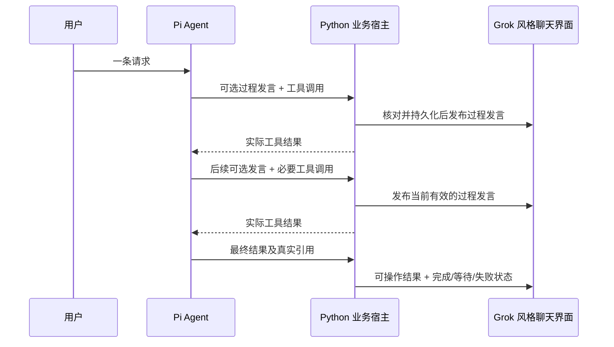

# Ceres2：检索、政策与同次请求多条回复

本文收敛本轮已确认的产品范围及实现方向，不替代 TASK 状态或测试报告。来源与逐轮决定见[设计访谈](ceres2-optimization-interview.md)，已有权威边界见[ADR 0001](../adr/0001-canonical-shopping-authority.md)与[ADR 0002](../adr/0002-python-business-pi-langgraph-runtime.md)。工作树为 `codex/ceres2-optimization-20261007`，基线 `b118dbea3852026c6a04c790b1e27df67c3c9c18`；本轮暂不合并。

## 本轮产品重点

用户希望可可帮助完成购物任务，并在一次请求处理中自然地先后发出多条有内容的回复。RAG 与完整政策提供可用知识；评测衡量检索、事实、任务推进、自然表达、时延和成本。订单、售后与商品详情负责让这条体验可以操作和验证，按闭环需要做最小改动。

当前页面已有奶油色 Grok 面板及 `--grok-*` 视觉变量。新增过程消息、商品详情、订单操作、售后申请和照片入口沿用这套样式及可可/墨墨身份，不借本轮重新设计整站。

## 同一次请求的公开消息

保留实际 Pi SDK，不换运行框架；借鉴 Hermes 的中途助手消息机制。一次用户请求对应一个运行，模型在该运行内的一次原生工具调用迭代可同时生成普通助手文本。完整、有内容且通过审校的文本成为独立过程发言；工具进度与最终结果各有完成语义。旧受控调用的 `{"interim_message":"公开短消息"}` 对象仍有真实测试调用方，亦须审校；不修复任意非法 JSON 或把生成的 `tool_calls` 正文当成工具执行。

真实 DeepSeek 采样暴露旧正文 JSON 握手的问题：模型反复只写空白，或把 `content/tool_calls` 写成普通 JSON 正文，去除 JSON mode 单独也未保证最终引用格式。引入原生结束工具后，`required` 三例完成但 6/6 过程轮无正文；同版 `auto` 对照三例都实际完成，5/6 过程轮有正文，其中一条通过审校在最终前发布。因而当前 main 使用原生 function calling、`tool_choice=auto` 与已确认的 thinking disabled；过程文本不由 JSON mode 约束，条数仍可为零。结束时模型单独调用 `finish_response`，参数沿用各模块原最终引用对象；Node 保存它并用 Pi `finishTurn` 结束同一循环，Python 继续逐个验证引用与权威事实。这个工具没有业务写权，也不追加总结生成调用。既有受控最终 JSON 路径保留其测试合同，普通最终文字不能被猜测为引用。出处和类型接缝见[官方与 SDK 核查](../../work/ceres2-optimization/research/deepseek-interim-compatibility.md)；旧采样不改写为通过，对照不代替生产版与自然性验收。

不是每次迭代都需要过程发言，简单问题仍可以一次回复。不得为了凑条数切段、强制固定气泡数或另开表达请求。工具状态使用原进度区域，私有推理与工具参数不进入聊天文本。中途说了“正在核对”不代表检索已成功或商品已经加购。

### 发布合同与必要接缝

1. Node worker 从已完成的 assistant 消息取得可公开文本，不直接将原始 token/reasoning 传给前端；最终引用、工具 allow-list 和停止预算保持适用。`finish_response` 只在已登记 guide_request 后单独调用，其轮次正文不作为过程消息。
2. Python 接收有序的中途消息候选，核对当前运行/任务/用户与内容合同，再分别写入消息历史和事件记录。消息写入不得提前提交购物、采购方案或售后业务事务。
3. 新的过程消息事件与工具进度、最终回答分别处理；消息使用稳定身份，SSE 重连和整轮结果同步不能再次插入同一气泡。
4. 前端在处理尚未结束时呈现完整过程发言，复用现有聊天视觉。用户改条件、切换或停止后，旧运行不能继续向当前对话追加内容；已发消息保留正确的历史含义。
5. 普通聊天现有 `validate_general_text`、商家事实引用/宿主渲染、明确确认与业务回执约束继续适用。新增事件不能成为未核验价格、库存、政策或成功承诺的出口。中途发言沿用现有模型事实边界，以过程语境补充区分查询对象与已知结果、否定下单与正向执行承诺；只允许不声称查询结果、不承诺商业执行的自然核对方向。带商家/执行断言或审校不确定的候选被扣留，普通聊天的审校提示不随过程语境变化。审校计入原预算/usage，最终业务事实仍由宿主独立渲染。

消息生成可以使用原工具迭代中的输出。当前工程已有真实模型审校与结果介绍调用；是否复用、合并或减少这些调用，按必要合同和实测决定。分别记录主循环、审校、结果介绍的 usage/时延，不将“没有新开气泡生成调用”解释为总调用、token 或费用必定不增加。

### 用户能观察到的验收

- 一个需要多步工具处理的请求，在最终完成前就能出现模型生成的有用过程发言；无需用户回复才能继续该运行。
- 仅输出工具调用的迭代不产生空气泡；简单请求不被强制扩成多条。
- 最终商品/清单/政策结果可操作、可追溯，过程发言不代替它。
- 中途停止、改条件、刷新或重连，不重放商业操作、不重复气泡、不虚报完成。
- 自然性通过同模型配对样本与盲评验证；运输事件或 mock 文本通过不代表“活人感”已验证。

## 政策与商品混合检索

政策与商品分别构建派生检索数据；召回与融合由 Python 提供，供 Pi/墨墨沿当前业务入口调用。中文稀疏召回与真实 embedding 召回独立取候选，用稳定来源身份去重并 RRF 融合。调用路径现有的门店、已审核商品及明确条件持续生效，不以新的页面边界限制跨货架明确查询。

语义 query 是召回输入，不能再统一用原 SQL 名称子串条件过滤两路候选；预算、品类、规格及饮食约束等可核实的业务条件仍由权威事实检查。用户的不同说法应能召回同一合适 SKU，语义相近不能代替满足硬约束。

本轮已选择本地中文 embedding。技术候选为 `BAAI/bge-small-zh-v1.5`，中文 sparse 采用单字与二元字组/ASCII 词＋SQLite FTS5；权重 revision、词表、编码指令和索引内容分别固定。当前 `sqlite-vec` 已锁但没有业务调用；demo 实现使用精确向量排序。[来源与取舍](../../work/ceres2-optimization/research/hybrid-retrieval.md)

固定开发查询集记录了正负例相似度间隔；当前固定 cosine relevance floor 为 recipe .54 / product .56 / policy .50，保持 raw sparse/dense/RRF 候选。hits 允许向量越过门槛，或查询字面量直接存在于候选标题/正文；后者保留单字“蛋”对明确记录鸡蛋的菜谱匹配，避免向量门槛覆盖原始词面证据。这些门槛仅有 demo 开发集校准，不等于独立验收或全部语义相关性保证。融合后，政策正文/适用版本和商品 Catalog/Offer 从权威数据重新读取；检索分数不能裁定售后资格、价格或库存，也不能授权加购。现有空候选中的条件映射与供给不足分别定位，不把所有失败都归为召回问题。

验收按同一查询集比较 sparse-only、dense-only、hybrid+RRF；保留原查询、候选身份、排名和版本，评测召回与最终答复。真实向量、独立两路和融合必须分别有执行证据，不能以关键词伪向量或平台参考代替。

## 八域政策与最小业务闭环

八个解释域为价格优惠、库存替代、配送服务、订单修改取消、履约异常、品质新鲜度、退货退款、食品安全与人工升级。每个政策有稳定条款身份、来源和适用版本；对应可办理场景由确定性服务给出条件和具体提案，两角色读取同一事实源。

政策按无理由诉求、质量问题、漏错破损、食品安全等具体问题区分，不以商品“不支持无理由退货”推导“质量问题也不能处理”。官方依据、平台特定历史规则和 Ceres 模拟承诺分开记录；没有明确依据的金额/时限不临时编入自动规则。

用户已同意的闭环支撑是：

- 商品详情连到现有 SKU/Offer 读取，延续现有直接加购与导购确认流程。
- 购物车数量实际写入，独立模拟结算生成持久订单，订单详情可进入。
- 最小模拟状态推进让同一新订单走到配送/签收；符合规则的取消有明确反馈，原始订单商品/金额记录保留。
- 质量/履约问题可按问题商品数量形成模拟申请，并可关联照片供人工查看；照片本身不自动证明质量或真实性。
- 提案说明对象、数量、预计金额及依据，明确确认后提交；质量申请确认后与回执同事务建立人工工单；“申请已提交”不表示已审批或退款到账。食品安全、伤害、赔偿和政策不确定事项使用已有人工流程。

不扩通用订单管理、真实资金执行、补送履约、完整审核运营平台或新提醒调度。上述支撑只接受必要业务接口、现有事务保护及统一 UI 的改动。

## 评测与数据回流

dots 负责评测方法、用例和评分规则；本会话负责可采集的业务/检索/消息证据及与实现的对应关系。既有 TASK10 的历史成绩不是本轮基线通过；两侧源码不同，比较前必须固定同一候选及语料、索引、模型、Prompt、用例版本。

本地需要提供的观察维度：

| 层次 | 要回答的问题 |
| --- | --- |
| 检索 | 目标条款/SKU 是否被召回，融合相对单路是否改善，引用是否仍是适用版本 |
| 业务 | 当前任务/约束是否保留，确认与数量是否正确，是否得到实际可见的购物/申请结果 |
| 消息 | 是否有有用过程发言，是否重复/打断，最终结果是否完整，用户停止是否生效 |
| 时间与成本 | 首个有意义消息、首个可操作结果、最终完成分别何时出现；各类模型调用及实际 token 是多少 |
| 严重错误 | 是否出现编造事实、越权、错单、重放或擅自放宽条件 |

气泡数量与“有进度文本”不单独作为成功指标。真实模型、受控技术验证、浏览器操作和本人验收各自记录；usage 未报告保持未知，失败和保护终止保留在统计中。具体分母、样本规模与发布门槛对齐云端评分协议，不先伪造一套改善数字。

失败回流按“采集→归因→人工标注→进入版本化开发/回归集→针对性优化→同版复测”执行。独立验收集与开发回归集区分；用户对某方案的确认只证明该次选择，不能直接当成对所有回复质量的正向标注。

## 完整 RAG / GraphRAG 的小型数据切片

用户已批准完整搭建，数据只适当补齐以覆盖测试。本轮固定 8 道菜、71 个已审核 demo SKU、18 个采购食材和 11 条覆盖八域的模拟政策；保留原 70 SKU，只补虾仁并纠正薯片不能满足鲜土豆采购的关联。可重复导入脚本记录原 Ceres 静态来源、commit、文件哈希及修改原因；不导入旧数据库或索引。

政策与商品使用真实本地 BGE-small-zh-v1.5，固定 revision `7999e1d3359715c523056ef9478215996d62a620`，normalized CLS / 512 维 / 两端不加 query instruction。稀疏召回使用中文单字、二元字组与 ASCII 词，SQLite FTS5 BM25；同一命名空间内独立召回后以 k=60 的 RRF 融合。demo 量级采用精确向量排序，无需独立向量服务。相关性、硬业务条件和售后资格各自验证。

菜谱图采用 Microsoft GraphRAG 3.2.0 官方 BYOG 路线：先从可核对的结构化事实生成文档、text units、Recipe / Ingredient / SKU 实体和 REQUIRES / PANTRY / PROCUREMENT_CANDIDATE 关系，再实际运行 `create_communities → create_community_reports → generate_text_embeddings`。这不是自动实体抽取的实验，结构化输入不需要由 LLM 重新猜测。社区生成摘要保留，同时附上对应成员原始实体描述，向量针对附有规范事实的报告生成。Local 与 Global 查询使用官方 API；末次输出只选择当前检索上下文中的实体数字引用，由宿主映射为规范 ID 并呈现原始描述，避免自由生成的分类/数量断言。Local 呈现聚焦事实；Global 保留已检索社区的完整规范视图及必需食材→菜谱关系，避免 LLM 的二次选择漏项。未知查询仍为空，模型选择本身的召回单独评测。旧自由摘要的实际矛盾采样保留为失败证据，不宣称模型通过此接缝而变准确。三个真实 embedding index 为 text_unit_text / entity_description / community_full_content。查询报告及数值引用可映射回稳定业务记录。先不用独立图数据库。

GraphRAG 使用独立 `.venv-graphrag`，不扩大原业务环境的 Torch 依赖；自定义官方模型 seam 接本地 BGE 及用户已批准的实际聊天模型。DeepSeek Chat JSON mode 将 schema 放入提示并用 Pydantic 校验；不宣称服务端原生支持 JSON Schema，不猜测修复非法输出，不更换模型。Local / Global 所需的异步流式响应亦实现，真实 usage 单独保留。

所有数据库、Parquet、LanceDB、模型权重与生成报告存于 Git 忽略的本地目录；Git 保留 fixture、导入/构建/查询代码、依赖版本、语料与 Prompt 版本及去敏验收证据。更换数据、模型、索引或 Prompt 后不能继承本轮成绩。

图检索只负责有出处的关系与说明；人数缩放、单位、包装件数、预算、价格、库存和确认仍由现有 Python 服务计算。关系不证明配料、营养、过敏安全、跨食材替代或家庭现有数量。未知菜谱和关系须保持未知。

真实请求问食材/用量时，不能只用候选菜名替代回答。`recipe_facts` 完成类型只接受本轮已查询菜谱引用，按原始基准人数与用量呈现必需食材、调料未知数量和共用必需食材；用户还问特定食材的商品信息时提供本菜谱规范 `ingredient_ids`，宿主重读当前 Catalog/Offer。它是事实查询，不选定 SKU、不建立采购方案、不加购，不因只读商品证据或空结果而触发额外购前介绍；需求人数的实际采购换算继续沿现有准备方案合同。

## 实现顺序与证据纪律

按最新授权先完成代表性数据与真实 hybrid smoke，再进入官方 GraphRAG 表、provider、建图和 Local/Global 查询 smoke。随后接入 Pi/墨墨证据、同次请求的自然过程发言和统一 UI，并补业务完整测试所需动作。每个切片由专职 Tester 执行必要验证；最终 Standards/Spec 独立只读审查。真实采样、离线测试、浏览器和用户本人验收分别记录，完成执行不等于已验收。
